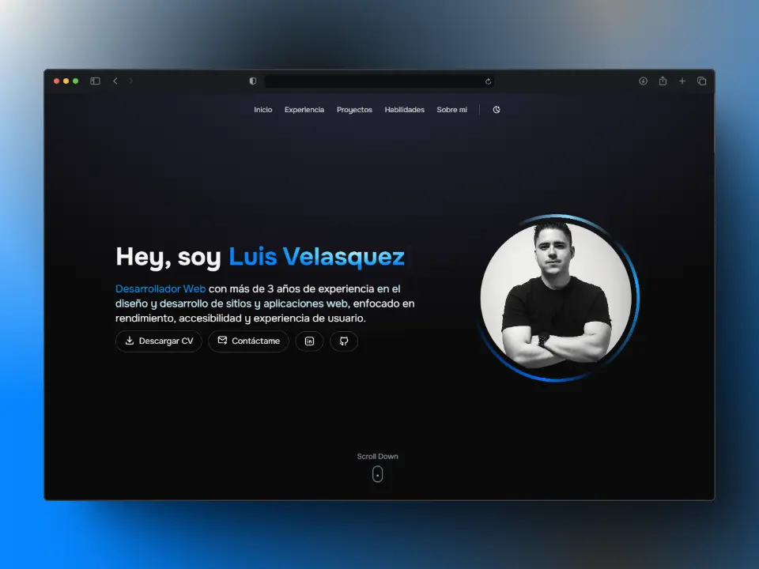

# 🚀 Portfolio Personal - LAVG

Portafolio personal desarrollado con **React** y **TailwindCSS** para mostrar mi experiencia, habilidades y proyectos.  
El diseño prioriza la **experiencia de usuario**, la **accesibilidad** y el **rendimiento**.

## 🎯 Demo en Vivo  
🔗 [Acceder a la aplicación](https://portfolio-lavg.vercel.app/)  

---

## ✨ Características Principales  

✅ **Modo Claro/Oscuro** - Cambio dinámico del tema visual.  
✅ **Multi-idioma (Español/Inglés)** - Soporte de idiomas con i18n.  
✅ **Diseño Responsive** - Adaptado para móviles, tablets y escritorio.  
✅ **Experiencia Accesible** - Compatible con lectores de pantalla y navegación fluida.  
✅ **Aplicación SPA (90%)** - Sin recargas de página para una experiencia más fluida.  
✅ **Código limpio y modular** - Fácil de entender y mantener.  

---

## 🛠 Tech Stack  

- **Framework:** React.js  
- **Estilos:** TailwindCSS  
- **Build Tool:** [Vite](https://vitejs.dev/)  
- **Íconos:** [Tabler Icons](https://tabler.io/icons)  

---

## Author

Desarrollado con 🤍 por [@LAVG2398](https://github.com/LuisVelasquezHN)
Contacto: [@LuisVelasquez](https://www.linkedin.com/in/luis-velasquez-768072284/)

